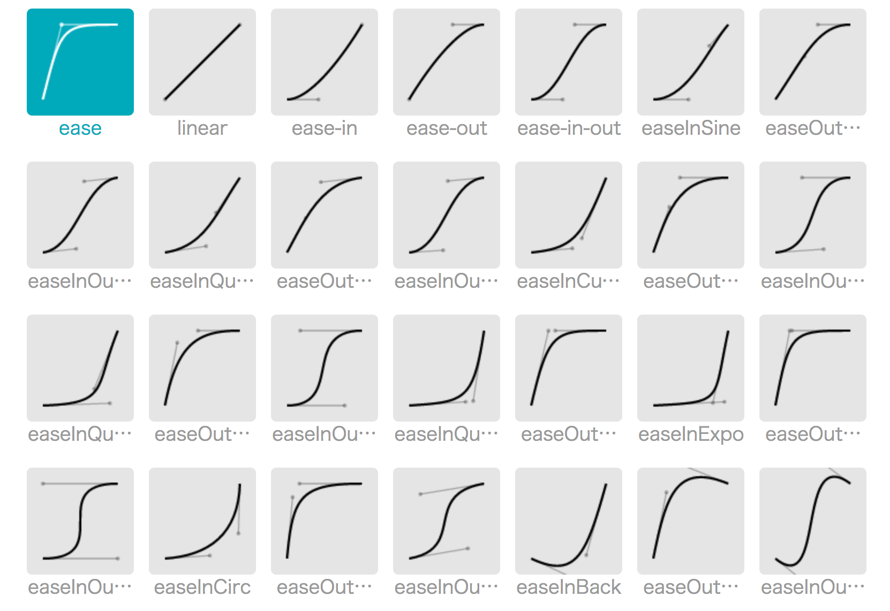

#easing.less

First of all, thanks [ai](https://github.com/ai/) and the great site [easings.net](http://easings.net), it offers a good site/tool to help developers choose the right easing function. This repo inspired by it also another great site [cubic-bezier.com](http://cubic-bezier.com).

Why not have a easing lib/mixins for Less? so I do it.


##Usage
1.  To use easing.less in your project, simply add the line into your own less file.

    ```css
    @import "easing.less";
    ```
2.  Use `.transition-timing-function` or `.animation-timing-function` mixins and available easing keywords as below.

    ```css
    @import "../easing.less";
    
    @keyframes bounce {
        0%, 20%, 53%, 80%, 100% {
            .transition-timing-function(easeOutCubic);
            transform: translate3d(0, 0, 0);
        }
        40%, 43% {
            .transition-timing-function(easeInQuint);
            transform: translate3d(0, -30px, 0);
        }
        70% {
            .transition-timing-function(easeInQuint);
            transform: translate3d(0, -15px, 0);
        }
        90% {
            transform: translate3d(0, -4px, 0);
        }
    }
    
    .bounce {
        animation-name: bounce;
        transform-origin: center bottom;
    }
    ```

    then, after you run the `lessc less-file.less` to compile , you will get following output.

    ```css
    @keyframes bounce {
      0%,
      20%,
      53%,
      80%,
      100% {
        transition-timing-function: cubic-bezier(0.215, 0.61, 0.355, 1);
        -webkit-transition-timing-function: cubic-bezier(0.215, 0.61, 0.355, 1);
        -moz-transition-timing-function: cubic-bezier(0.215, 0.61, 0.355, 1);
        -o-transition-timing-funtion: cubic-bezier(0.215, 0.61, 0.355, 1);
        transform: translate3d(0, 0, 0);
      }
      40%,
      43% {
        transition-timing-function: cubic-bezier(0.755, 0.05, 0.855, 0.06);
        -webkit-transition-timing-function: cubic-bezier(0.755, 0.05, 0.855, 0.06);
        -moz-transition-timing-function: cubic-bezier(0.755, 0.05, 0.855, 0.06);
        -o-transition-timing-funtion: cubic-bezier(0.755, 0.05, 0.855, 0.06);
        transform: translate3d(0, -30px, 0);
      }
      70% {
        transition-timing-function: cubic-bezier(0.755, 0.05, 0.855, 0.06);
        -webkit-transition-timing-function: cubic-bezier(0.755, 0.05, 0.855, 0.06);
        -moz-transition-timing-function: cubic-bezier(0.755, 0.05, 0.855, 0.06);
        -o-transition-timing-funtion: cubic-bezier(0.755, 0.05, 0.855, 0.06);
        transform: translate3d(0, -15px, 0);
      }
      90% {
        transform: translate3d(0, -4px, 0);
      }
    }
    .bounce {
      animation-name: bounce;
      transform-origin: center bottom;
    }
    ```
3.  Also you can use the easing keyword variables, like below.

    ```css
    @import "../easing.less";
    
    @keyframes bounce {
        0%, 20%, 53%, 80%, 100% {
            transition-timing-function: @easeOutCubic;
            transform: translate3d(0, 0, 0);
        }
        40%, 43% {
            transition-timing-function: @easeInQuint;
            transform: translate3d(0, -30px, 0);
        }
        70% {
            transition-timing-function: @easeInQuint;
            transform: translate3d(0, -15px, 0);
        }
        90% {
            transform: translate3d(0, -4px, 0);
        }
    }
    
    .bounce {
        animation-name: bounce;
        transform-origin: center bottom;
    }
    ```
    you will get following output once you compile the less to css.

    ```css
    @keyframes bounce {
      0%,
      20%,
      53%,
      80%,
      100% {
        transition-timing-function: cubic-bezier(0.215, 0.61, 0.355, 1);
        transform: translate3d(0, 0, 0);
      }
      40%,
      43% {
        transition-timing-function: cubic-bezier(0.755, 0.05, 0.855, 0.06);
        transform: translate3d(0, -30px, 0);
      }
      70% {
        transition-timing-function: cubic-bezier(0.755, 0.05, 0.855, 0.06);
        transform: translate3d(0, -15px, 0);
      }
      90% {
        transform: translate3d(0, -4px, 0);
      }
    }
    .bounce {
      animation-name: bounce;
      transform-origin: center bottom;
    }
    ```

##Get your own easing curve

The easy way to get it is to go [cubic-bezier.com](http://cubic-bezier.com). Then you can play and get the easing curve you need, actually, you get just 4 numbers like `.17, .67, .83, .67`, and you need to think about an appropriate name for it. :O)

##Add your easing curve to easing.less

1.  Clone the repo on your local.
2.  Run following command to install the dependencies.

    ```bash
    npm install
    ```

3.  Add the easing settings to file ‘easings.json’ in JSON style, like below, make sure your name is not duplicated with others.

    ```javascript
        "new-ease-out": "0, 0.58, 0.58, 1"
    ```

4.  Run command below to build the easing.less file.

    ```bash
    grunt
    ```

5.  Done. You already get the new easing.less with your customized curves.

##Cheat Sheet

```javascript
{
"ease": "0.25, 1, 0.25, 1",
"linear": "0, 0, 1, 1",
"ease-in": "0.42, 0, 1, 1",
"ease-out": "0, 0, 0.58, 1",
"ease-in-out": "0.42, 0, 0.58, 1",
"easeInSine": "0.47, 0, 0.745, 0.715",
"easeOutSine": "0.39, 0.575, 0.565, 1",
"easeInOutSine": "0.445, 0.05, 0.55, 0.95",
"easeInQuad": "0.55, 0.085, 0.68, 0.53",
"easeOutQuad": "0.25, 0.46, 0.45, 0.94",
"easeInOutQuad": "0.455, 0.03, 0.515, 0.955",
"easeInCubic": "0.55, 0.055, 0.675, 0.19",
"easeOutCubic": "0.215, 0.61, 0.355, 1",
"easeInOutCubic": "0.645, 0.045, 0.355, 1",
"easeInQuart": "0.895, 0.03, 0.685, 0.22",
"easeOutQuart": "0.165, 0.84, 0.44, 1",
"easeInOutQuat": "0.77, 0, 0.175, 1",
"easeInQuint": "0.755, 0.05, 0.855, 0.06",
"easeOutQuint": "0.23, 1, 0.32, 1",
"easeInExpo": "0.95, 0.05, 0.795, 0..035",
"easeOutExpo": "0.19, 1, 0.22, 1",
"easeInOutExpo": "1, 0, 0, 1",
"easeInCirc": "0.6, 0.04, 0.98, 0.335",
"easeOutCirc": "0.075, 0.82, 0.165, 1",
"easeInOutCirc": "0.785, 0.135, 0.15, 0.86",
"easeInBack": "0.6, -0.28, 0.735, 0.045",
"easeOutBack": "0.175, 0.885, 0.32, 1.275",
"easeInOutBack": "0.68, -0.55, 0.265, 1.55"
}
```

## Live Demo
So far, there’s only 2 less pages under demo folder, the live demo is in progress...


## TEST
